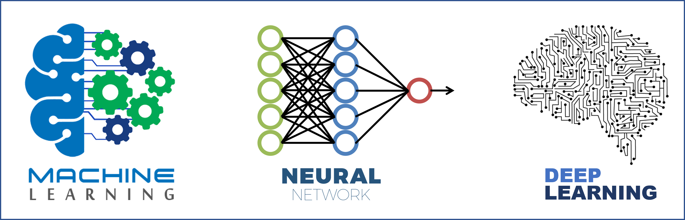

--------------------------------------------------------------------------------
# Introduction
In this repository e will learn the algorithms and knowledge about Machine Learning and Deep Learning. We will build projects from basic to advanced. For most I have also done video explanations on YouTube if you want a walkthrough for the code. If you got any questions or suggestions for future videos I prefer if you ask it on [YouTube](https://www.youtube.com/c/AladdinPersson). This repository is contribution friendly, so if you feel you want to add something then I'd happily merge a PR :smiley:

## Table Of Contents
- [Machine Learning]
- [Deep Learning]
	- [CNN Architectures]
  - [Object Detection]
  - [Image Segmentation]
